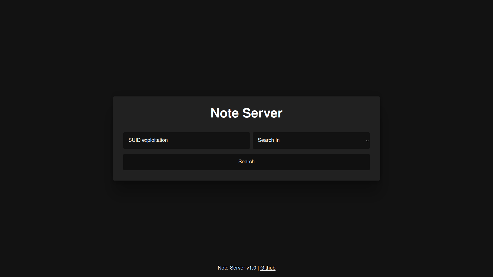

<p align="center">
  
</p>
<h1 align="center">Note Server 📝 A simple web server to host your notes</h1>
<h3 align="center">
  Just a simple web server that you can use to host/search
  your markdown notes - written in nodejs!
</h3>

<p align="center">
  
  
  
  
</p>

<br>

# 😋 Setup
### Install `npm` and `nodejs` first!
To install note server:
```bash
git clone https://github.com/ngn13/note-server.git
cd note-server
npm i
```
Then make a directory named `notes` and place all your notes
in there, you can have subdirs, just make sure your notes are 
in **markdown format**! 
On startup note server will create routes for each of your notes.
To start the server:
```
npm run start
```
This will start the note server on port 8082, you can change the port by
editing [config.json](config.json)

<br>

# 👀 Autostart with PM2
You can install PM2 and use it with note server to start the server
on boot, to do this run the following commands in note-server directory
```bash
npm i pm2 -g
pm2 start index.js
```
Then you can add pm2 to startup by running:
```bash
pm2 startup
```

# 🔗 Credit
> [github-markdown-css](https://github.com/sindresorhus/github-markdown-css) - Used for markdown rendering
