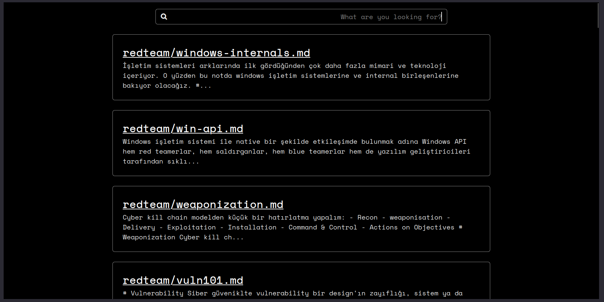
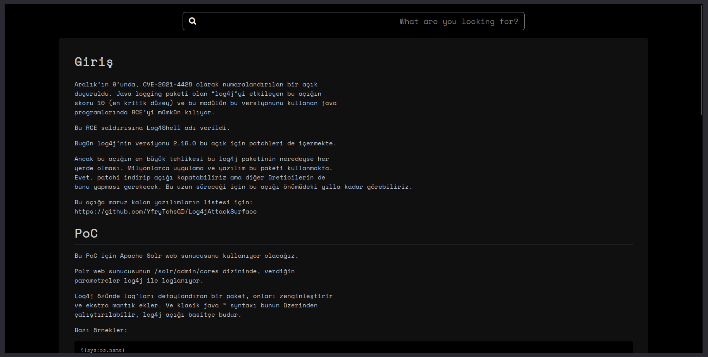

<p align="center">
  
  
</p>
<h1 align="center">Note Server 📝 Host your markdown notes</h1>
<h3 align="center">
  Just a web server that you can use to host
  your markdown notes - written in Go!
</h3>

<p align="center">
    
    
    
</p>

## ✨ Features
- Minimal dark UI with zero javascript 
- Content and path based searching 
- Modification time based sorting
- Image and link support 

## 😋 Setup
### with Docker 
```bash
# bring in your notes, for example:
git clone https://github.com/your/cool-notes.git
mv cool-notes notes

docker run -d -v $PWD/notes:/app/notes   \
              -p 80:8080                 \
              --name my-notes            \
              ghcr.io/ngn13/note-server 
```
Now you can connect to note server on port 80, you can 
extend this setup with a reverse proxy if you wish.

## 🔄 Auto-updating your notes 
If you are using git for your notes, then you can 
setup a cronjob to auto-update your notes.

To do this add this enrty to your `/etc/crontab`:
```
  0  *  * * *   your-username     cd /path/to/note-sever/notes && /usr/bin/git pull 
```
This entry will pull and sync your notes with the remote every hour

## 🔗 Credit
> [github-markdown-css](https://github.com/sindresorhus/github-markdown-css) - Used for markdown rendering

> [nerdfonts](https://github.com/ryanoasis/nerd-fonts) - Fonts used in the application 
